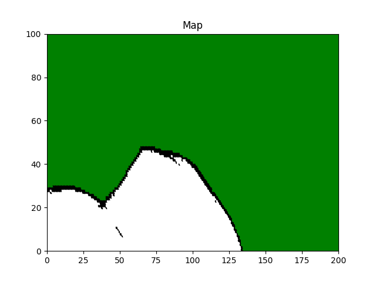
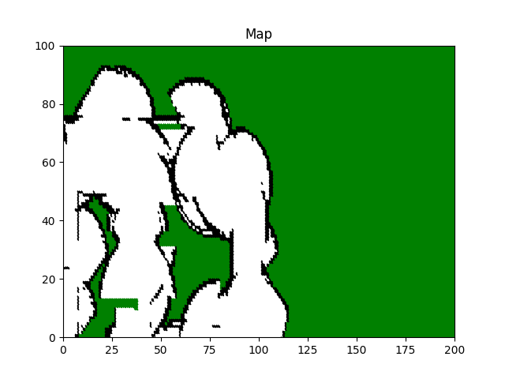

# Occupancy Grid Mapping

This is the C++ implementation of an occupancy grid mapping algorithm based on detections from ultrasonic sensors.

## Assumptions

1. **Grid Model:** Each cell in the grid is modeled as a binary random variable representing its occupancy state (_occupied_, _free_, or _unknown_).
2. **Static Environment:** The map is assumed to be static.
3. **Independence:** The occupancy states of the cells are independent.
4. **Speed of Sound:** The speed of sound is assumed to be 343 m/s (used to calculate distance based on the time-of-flight of the echo).
5. **Units:** The XY coordinates of the robot in the dataset are measured in meters.
6. **Sensor Ranges:** The effective ranges of the sensors are provided.

## Solution
### 1. Inverse Sensor Model (m_i, x_t, y_t, z_t)
We update the occupancy probability of each cell using a log-odds representation. The pseudo-algorithm is as follows:
```sh
1. Let (x_i, y_i) be the center of cell m_i, beta be detection angle of sensor, alpha be thickness of observed obstacles

2. Compute the range r:
   r = sqrt((x_i - x)^2 + (y_i - y)^2)

3. Compute the angle φ:
   φ = atan2(y_i - y, x_i - x) - θ

4. Find the closest sensor
   k = argmin (φ-φ_j,sensor)

5. Check if r is outside the valid sensor range or if φ deviates too much:
   if r > min(z_max, z_t^k + α/2) OR | φ - θ_k,sens | > β/2 then
       return l_0  (unknown state)

6. Check if the cell is occupied:
   if z_t^k < z_max AND | r - z_t^k | < α/2 then
       return l_occ  (occupied state)

7. Check if the cell is free:
   if r ≤ z_t^k then
       return l_free  (free state)
```
2. **C++ Implementation**

   The project is organized into the following components:

   **Classes:**
   - **Robot:** Handles the robot’s state (position and orientation).
   - **Map:** Represents the environment as a grid and manages the occupancy updates.
   - **Sensor:** Processes the sensor measurements.
   **Visualization:**  
   The occupancy grid map is visualized using the Matplotlib C++ interface.
### Compiling
Using CMake to build project and link against required Python3 packages.
```bash
git clone <URL>
cd <project-directory>
mkdir build
cd build
cmake -G "MinGW Makefiles" ..
Make
./output.exe
```
### Generated Map
#### Original Map

**Grey:** Unknown &nbsp;&nbsp; **Black:** Occupied &nbsp;&nbsp; **White:** Free



#### Map with Modified Dataset

**Note:**  
Upon reviewing the data in `robot.csv`, we observed that at 10 milliseconds the coordinate is recorded as `(0.25, 3.742)`, which is unrealistic if the task assumes that the robot starts at `(0,0)`. Therefore, we interpret the `(posx, posy)` values as being relative to the first measured data point. By subtracting `(0.25, 3.742)` from every subsequent pose (i.e., transforming each pose to `(posx-0.25, posy-3.742)`), the resulting occupancy grid map aligns much more reasonably with the expected trajectory and environment.


### References
1. [LiDAR Inverse Sensor Modelling for Occupancy Grid Mapping in the Context of Autonomous Vehicles - Page 22] http://www.diva-portal.org/smash/get/diva2:1900124/FULLTEXT01.pdf
2. [Occupancy grid mapping lecture] https://www.youtube.com/watch?v=1f_m5aJFIj4
3. [Compiling a program — Matplotlib for C++ documentation] https://matplotlib-cpp.readthedocs.io/en/latest/compiling.html
4. [Robond occupancy grid mapping] https://github.com/korhanmd/robond-occupancy-grid-mapping
5. [Install and Run Matplotlib for C++ in VS Code] https://www.youtube.com/watch?v=Xp3ntYGs8No&t=400s
